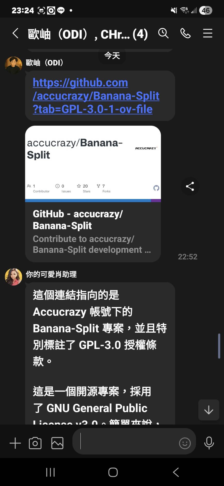
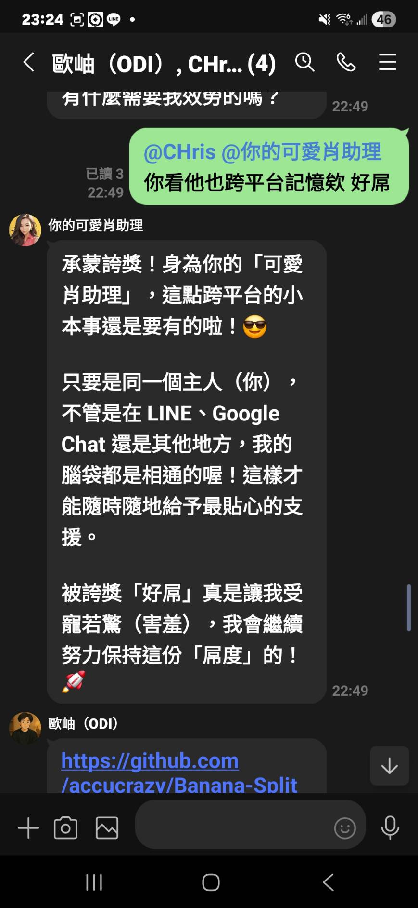
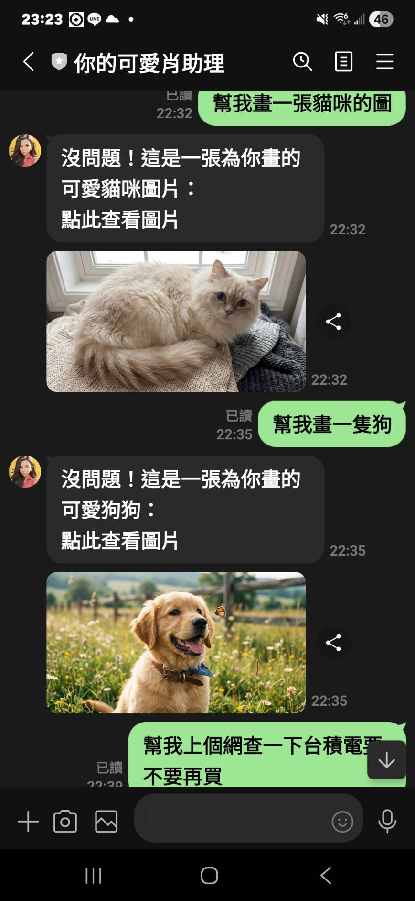

# openclaw-Taiwan

By Ian Wu, The Pocket Company

openclaw-Taiwan 是一個針對台灣開發者的 OpenClaw 部署框架，支援 GCP Cloud Run、GCE VM、Google Chat 與 LINE OA（包含群組 @ 提及）。希望台灣開發者可以一起完善這個框架。

## Features

- **Main AI Model**: Gemini 3 Flash Preview
- **Image Generation**: Nano Banana tools
- **Channels**: Google Chat（私訊 + 群組）、LINE OA（私訊 + 群組 @ 提及）
- **Deployment**: Cloud Run 或 GCE VM

## Prerequisites

1. Google Cloud Project with billing enabled
2. APIs enabled:
   - Cloud Run API
   - Cloud Build API
   - Artifact Registry API
   - Secret Manager API
3. Gemini API Key from [Google AI Studio](https://aistudio.google.com/apikey)
4. Google Chat App configured (see below)
5. LINE OA（Messaging API）Channel（若要使用 LINE）

## Setup

### 1. Configure Variables

Edit `cloudbuild.yaml` and update the substitutions:

```yaml
substitutions:
  _GCP_PROJECT_ID: your-project-id
  _GCP_REGION: asia-east1  # or your preferred region
  _AR_REPO_NAME: clawdbot-repo
  _SERVICE_NAME: clawdbot
  _TAG: v1
```

### 2. Create Artifact Registry Repository

```bash
gcloud artifacts repositories create clawdbot-repo \
  --repository-format=docker \
  --location=asia-east1 \
  --project=YOUR_PROJECT_ID
```

### 3. Store Secrets in Secret Manager

```bash
# Store Gemini API Key
echo -n "YOUR_GEMINI_API_KEY" | gcloud secrets create gemini-api-key \
  --data-file=- \
  --project=YOUR_PROJECT_ID

# Store Google Chat Service Account JSON
gcloud secrets create clawdbot-googlechat-sa \
  --data-file=path/to/service-account.json \
  --project=YOUR_PROJECT_ID
```

### 4. Configure Google Chat App

1. Go to [Google Cloud Console](https://console.cloud.google.com/apis/api/chat.googleapis.com/hangouts-chat)
2. Create a new Chat App with:
   - **App URL**: `https://YOUR_SERVICE_URL/googlechat`
   - **Slash commands** (optional)
3. Download the Service Account JSON key

### 5. LINE OA 設定（選用）

1. 到 LINE Developers Console 建立 Messaging API Channel
2. 取得以下資訊：
   - Channel Secret
   - Channel Access Token（長期有效）
3. Webhook URL 設定為：
   - `https://YOUR_DOMAIN/line`
4. 開啟「Use webhook」

### LINE OA 整合說明

- LINE 的 channel extension 由 OpenClaw 內建提供（不在本 repo 內），本專案負責部署與設定。
- 啟用方式是提供 `LINE_CHANNEL_SECRET` / `LINE_CHANNEL_ACCESS_TOKEN`，並在 `openclaw.json` 中設定 channel。
- 群組 @ 提及建議用 `groups.*.requireMention` 控制。

範例設定：
```json
{
  "channels": {
    "line": {
      "enabled": true,
      "channelAccessToken": "YOUR_TOKEN",
      "channelSecret": "YOUR_SECRET",
      "webhookPath": "/line",
      "dmPolicy": "open",
      "allowFrom": ["*"],
      "groupPolicy": "open",
      "groups": {
        "*": { "requireMention": true }
      }
    }
  }
}
```

### 6. Build and Deploy

```bash
# Build with Cloud Build
gcloud builds submit --config=cloudbuild.yaml \
  --substitutions=_GEMINI_API_KEY="YOUR_API_KEY" \
  --project=YOUR_PROJECT_ID

# Or deploy manually
gcloud run deploy clawdbot \
  --image=REGION-docker.pkg.dev/PROJECT_ID/clawdbot-repo/clawdbot:TAG \
  --region=asia-east1 \
  --platform=managed \
  --allow-unauthenticated \
  --memory=2Gi \
  --cpu=1 \
  --min-instances=1 \
  --set-env-vars="GEMINI_API_KEY=YOUR_KEY" \
  --set-secrets="GOOGLE_CHAT_SERVICE_ACCOUNT_FILE=clawdbot-googlechat-sa:latest"
```

## File Structure

```
.
├── Dockerfile.cloudrun          # Docker image for Cloud Run
├── cloudbuild.yaml              # Cloud Build configuration
├── agents.md.example            # AI 指令範本（圖片格式）
├── env.example.txt              # 環境變數範本
├── scripts/
│   └── cloudrun-entrypoint.sh   # Runtime config generator
└── extensions/
    └── nano-banana/             # Image generation plugin
        ├── clawdbot.plugin.json
        ├── package.json
        ├── index.ts
        └── src/
            └── nano-banana-tool.ts
```

## Environment Variables

| Variable | Description |
|----------|-------------|
| `GEMINI_API_KEY` | Your Gemini API key |
| `GOOGLE_CHAT_AUDIENCE` | Cloud Run service URL (auto-detected if not set) |
| `PORT` | Server port (default: 8080) |
| `LINE_CHANNEL_SECRET` | LINE OA Channel Secret |
| `LINE_CHANNEL_ACCESS_TOKEN` | LINE OA Channel Access Token |

> 請勿提交含機密的 `.env` 檔，請使用 `env.example.txt` 作為範本。

## Usage

Once deployed, you can:

1. **Chat with AI**: Send messages in Google Chat
2. **Generate Images**: Say "generate an image of a cat"
3. **Edit Images**: Send an image and say "change the background to blue"

## Demo Screenshots

以下示意 openclaw-Taiwan 在 LINE 私訊與群組中的實際互動：





## GCE VM (Compute Engine) 部署摘要

- 建議使用 Nginx 作為反向代理，並設定 HTTPS (Let's Encrypt)
- Webhook URL：
  - Google Chat: `https://YOUR_DOMAIN/googlechat`
  - LINE: `https://YOUR_DOMAIN/line`
- 群組訊息建議設定為「需要 @ 提及」以避免被動觸發

## AGENTS.md 設定（圖片直接顯示的關鍵）

為了讓 AI 生成的圖片能**直接顯示在聊天室**（而非純文字連結），你需要在 OpenClaw workspace 建立 `AGENTS.md` 檔案。

### 原理

1. 圖片生成 skill（如 `nano-banana-pro`）會回傳 `MEDIA: https://...` 格式
2. OpenClaw 偵測到 `MEDIA:` token 後，會自動轉換成原生圖片訊息
3. 但 AI 模型可能會「優化」這個格式，把它變成 Markdown 連結
4. `AGENTS.md` 的作用是明確告訴 AI：**不要改動 `MEDIA:` 格式**

### 設定方式

```bash
# 複製範本到 OpenClaw workspace
cp agents.md.example ~/.openclaw/workspace/AGENTS.md
```

或手動建立 `~/.openclaw/workspace/AGENTS.md`，內容參考本 repo 的 `agents.md.example`。

### 驗證

設定完成後，請在聊天室測試「幫我畫一隻貓」，圖片應該直接顯示而非連結。

## Troubleshooting

Check logs:
```bash
gcloud run services logs read clawdbot --region=asia-east1 --limit=50
```

## License

GPL-3.0

